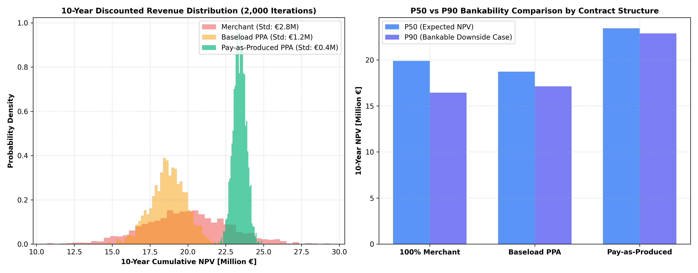

# ☀️ Corporate PPA Pricing & 10-Year Monte Carlo Risk Valuation (Solar PV)

A quantitative financial valuation and risk-modeling engine executing a **2,000-iteration Monte Carlo simulation** to price and evaluate 10-year **Corporate Power Purchase Agreements (PPAs)** for a 50 MWp utility-scale solar asset in Germany.

---

## 📌 PPA Contract Structures Evaluated

1. **100% Merchant Exposure:** Full spot price volatility with declining solar capture factor (cannibalization effect).
2. **Pay-as-Produced (PaP) PPA:** Fixed strike price (€62.0/MWh) for all generated volume; volume risk retained, price/shape risk transferred.
3. **Baseload Corporate PPA:** Fixed strike price (€68.0/MWh) for a continuous flat volume (6.0 MW flat / 52,560 MWh/yr); asset owner manages volumetric and profile balancing costs.

---

## 📊 Monte Carlo Simulation Benchmark (2,000 Iterations @ 6.5% WACC)

| Contract Structure | P50 Expected 10-Yr NPV | P90 Bankable Downside | Standard Deviation | 95% Value at Risk (VaR) |
| :--- | :---: | :---: | :---: | :---: |
| **Pay-as-Produced PPA** | **€23.42M** | **€22.87M** | **€0.42M** | **€0.70M** |
| **100% Merchant Exposure** | €19.89M | €16.44M | €2.79M | €4.62M |
| **Baseload Corporate PPA** | €18.71M | €17.12M | €1.18M | €2.01M |

---

## 📈 Visual Valuation Breakdown

---

## 🛠️ Tech Stack
* **Language:** Python 3.10+
* **Quantitative Finance & Modeling:** `numpy`, `pandas`
* **Data Visualization:** `matplotlib`
